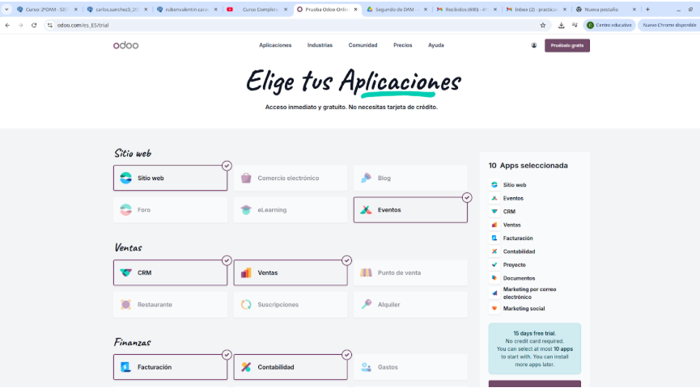

# 03 — Instalación y prueba (15 días) / Alta e instalación de apps

> Estructura orientativa

## Requisitos previos
- Navegador actualizado.
- Cuenta de correo para alta.

## Pasos
- Primero vas a iniciar sesion con una cuenta nueva y vas a elegir la opción de una prueba gratuita de 15 dias
- Una vez instalado puedes elegir las aplicaciones necesarias, en mi caso voy a elegir estas
   - 