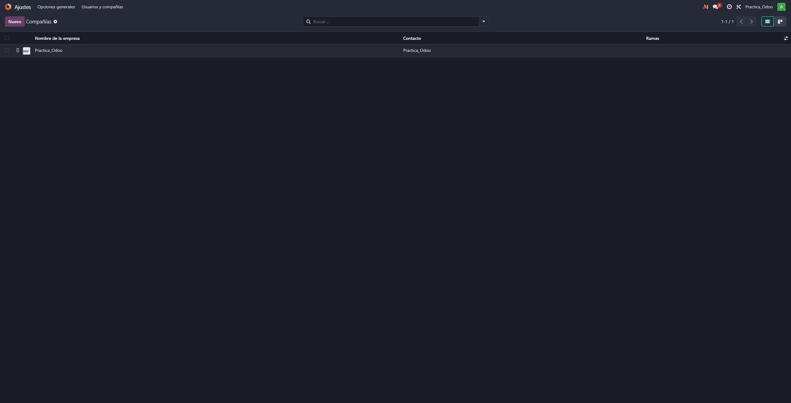
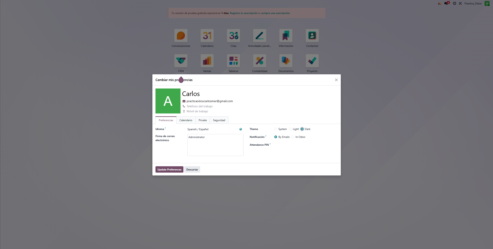

# 04 — Ajustes generales

> Estructura orientativa

- Activar **notificaciones** y (opcional) **PWA**.
- Perfil: modo oscuro, datos, **2FA**, firma email, notificaciones en Odoo.
- **Usuarios y compañías**: roles por módulo; en Enterprise se paga por usuario.
- **Idiomas** y **diseño de documentos** (plantillas de factura).
- **Emails de resumen**: periodicidad y destinatarios.

- Tienes opción de ver las notificaciones
- Dandole a tu perfil arriba a la derecha puedes dale a la opcion de configurar tu perfil, y dentro editar tu información, como por ejemplo la firma electronica o tambien puedes cambiar tu foto de perfil
   - 
- En opciones generales tienes tambien la posibilidad de personalizar la empresa en odoo, como cambiarle el nombre, la imagen o la información de la empresa
   - 
- En ajustes hay una pestaña donde puedes cambiar los idiomas, si le damos podemos cambiar al que queramos
   - 
- Si hacemos clic en el boton de arriba otra vez, en vez de empresas, podemos personalizar nuestro usuario.
   - 
- Si bajamos un poco podemos ver un boton en el que pone "Diseño de documento", esta pestaña nos creara documentos automatizados y con la posibilidad de personalizarlos
   - 
- En ajustes tambien esta la pestaña de correos electronicos de resumen, el cual nos hace un resumen periodicamente, y podemos elegir si hacerlo diariamente, semanalmente, mentualmente, etc... entre otras cosas
   - 