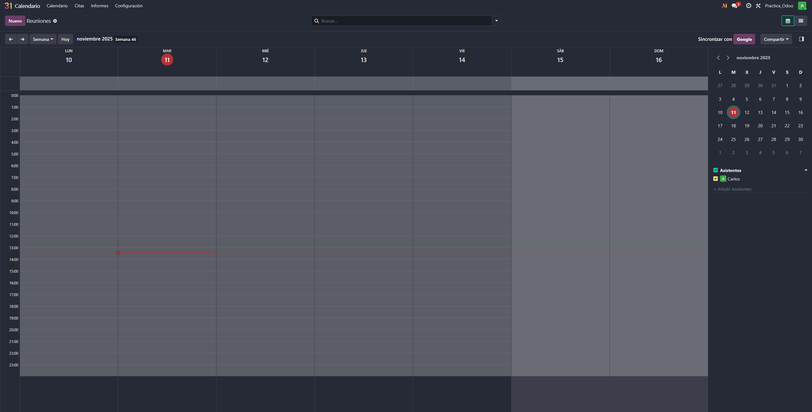
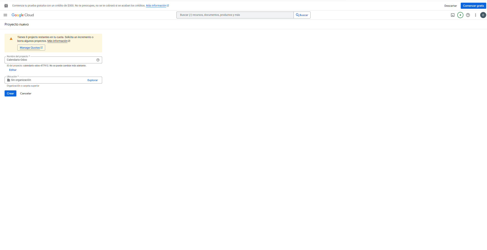

# 07 — Calendario y Citas

> Estructura orientativa

- Calendario (día/semana/mes) + disponibilidad del equipo.
- **Integración con Google Calendar** (API OAuth GCP).
- **Odoo Meet** (videollamadas) o enlaces externos.
- **Módulo Citas** (Enterprise): enlaces públicos, buffers, preguntas previas.

- Empezaos entrando en la app de caldario, deberia de salirnos esto

- Vamos a vincular el calendario con una API de google, primero de todo tenemos que entrar en google console

- Dentro, vamos a crear un proyecto 

- Dentro, vamos a buscar "calendar" en las APIs y habilitamos esta

