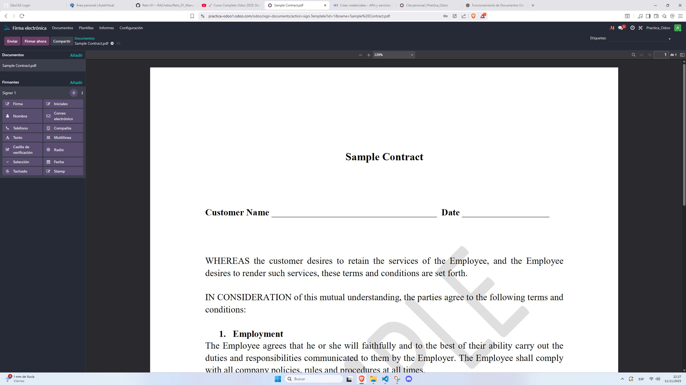

# 09 — Documentos, Firma e Información (Knowledge)

> Estructura orientativa

- **Documentos**: repositorio, edición hojas, dividir PDFs, etiquetas/flujo.
- **Firma electrónica**: campos (firma/nombre/fecha), envío y registro.
- **Información (Knowledge)**: wiki tipo Notion, permisos y publicación.

- En los documentos se pueden subir archivos como PDF, imagenes, excel, word, o cualquier otro documento

- Es de acceso rapido, y se pueden compartir bastante facil

- Luego tenemos la firma electronica, si entramos, podemos ver un contrato de prueba, se puede añadir tambien contratos reales, y a la izquierda tienes opciones para modificarlo

