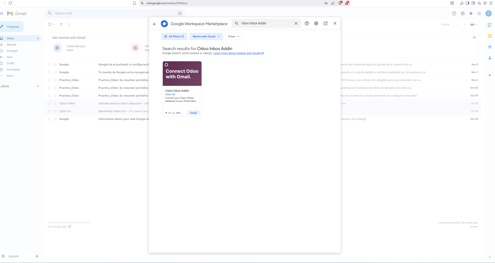
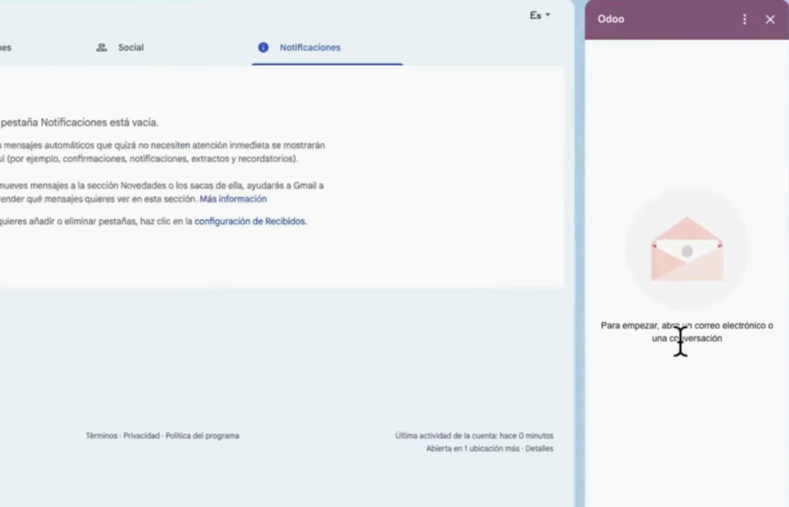
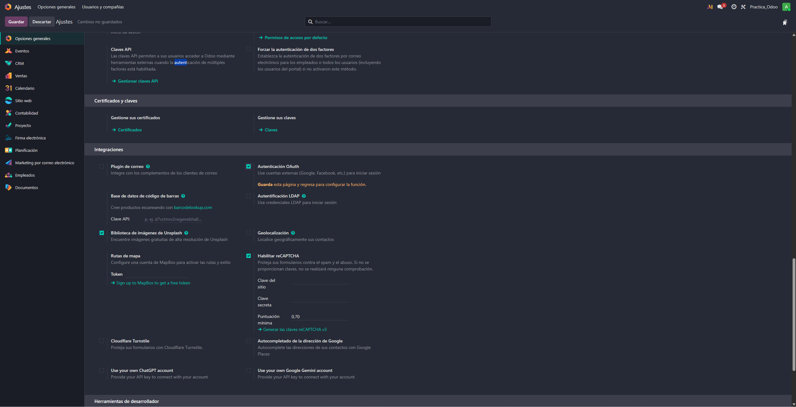
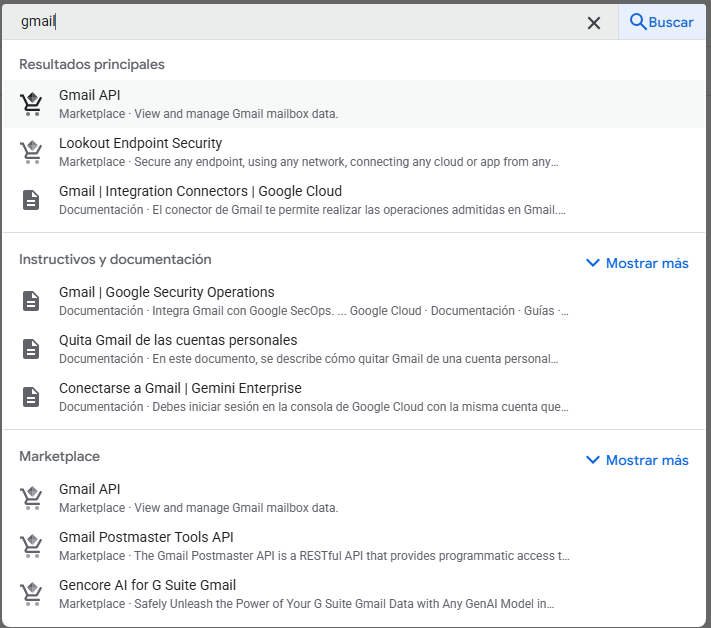
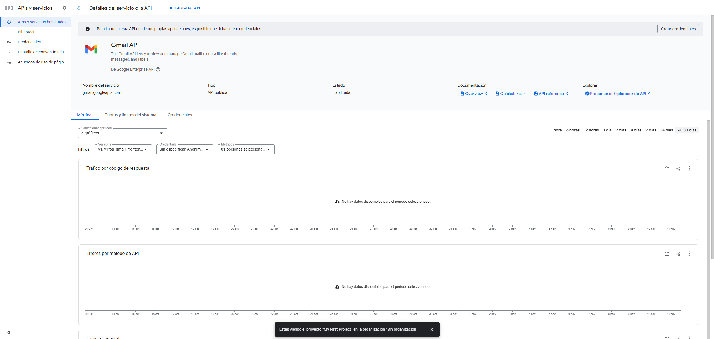
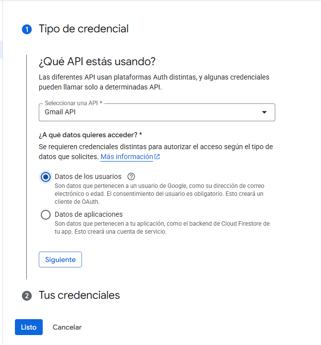
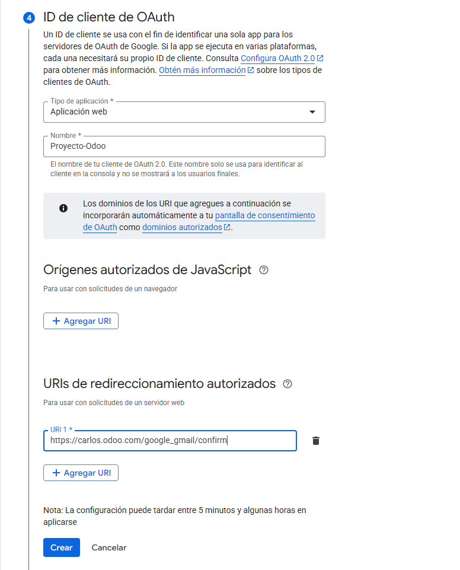
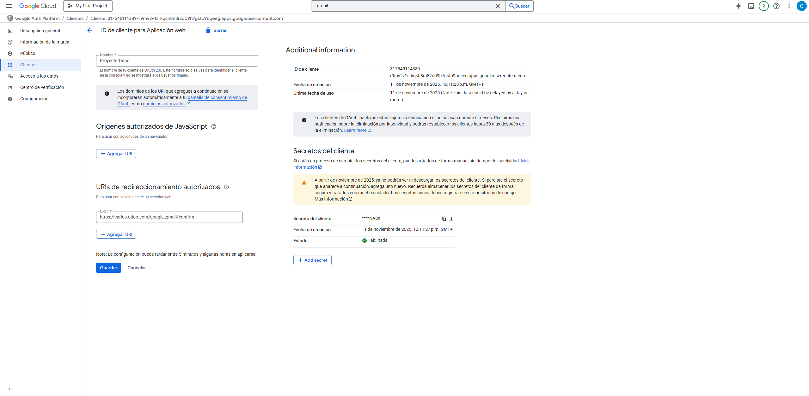

# 05 — Integración con Gmail (OAuth GCP + Add-on)

- En opciones en la parte de abajo vamos a activar la opcion de plugin de correo

- Desde el correo, vamos a buscar a la aplicacion de odoo inbox admin, y vamos a iniciar sesion

- Aqui hay una comprobación de que odoo está instalado en el gmail

- Ahora en ajustes tenemos que darle a autentificacion oauth y guardar

- Despues le damos a proveedores oauth y sale esta pestaña

- Ahora vamos a entrar en la pagina de proyecto en cloud para vincular el gmail

- Una vez dentro vamos a buscar la API de gmail

- Una vez la hayamos encontrado, elegimos nuestro proyecto

- Despues vamos a darle al boton de credenciales de la derecha, y deberia de abrirse una pestaña como esta, y vamos a darle a datos de usuario, y continuamos

- Ahora ponemos el nombre de nuestro proyecto, nuestro correo electronico y el correo de contacto con el desarollador (puede ser el mismo)

- Si continuamos al paso 3 podemos elegir los permisos, hay que marcar los que tengo

- Para el cuarto paso hay que elegir "Aplicacion Web" y poner tu url de redireccionamiento, que seria "https://usuario.odoo.com/google_gmail/confirm"

- Ahora tenemos que ir a las credenciales y entrar en nuestro proyecto

- Y aqui tendriamos todos nuestros datos

- Por ultimo vamos a copiar el ID del cliente y vamos a pegarlo en la pestaña que estabamos en odoo, activamos el "permitido" e iniciamos sesion en google

- Ahora si le damos a la opcion en ajustes de utilizar servidores de correo electronico personalizados, nos sale una pestaña nueva, ahí copiamos el ID, y el secreto

