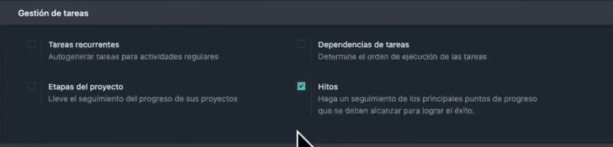

# 08 — Proyectos (Kanban)

> Estructura orientativa

- Proyectos, etapas, tareas, **subtareas**.
- **Tareas recurrentes**, **dependencias**, **hitos**.
- Vistas: tarjetas, lista, calendario propio.
- Registro rápido de actividades y **calificación del cliente**.

- Primero de todo vamos arriba a la izquierda y creamos un proyecto, y en clientes ponemos odoo, tambien se puede poner un alias si lo prefieres

- Una vez creamos el proyecto, arriba a la izquierda tienes una opcion para crear etapas

- En la pestaña de en medio podemos crear una tarea

- Una vez creada, podemos moverla para saber si la dejamos en la bandeja de entrada, en progreso o donde queramos.

- Hay una pestaña en la cual puedes hacer subtareas

- Si nos vamos a ajustes del proyecto, tenemos la opcion de etapas de proyecto, la vamos a marcar

- Luego podemos activar la opcion de tareas recurrentes, esta opcion nos habilita el poder cambiar la fecha limite para una tarea

- Luego tenemos la opcion de dependencias de tarea

- Esta opcion lo que hace es que le obligue a la gente a hacer algunas tareas antes que esa

- Y por ultimo está la opción de hitos, esta opcion hace que cuando se cumplan cosas que se consideren un logro, lo resalte

- Debajo en las opciones tienes la opcion de calificaciones del cliente

