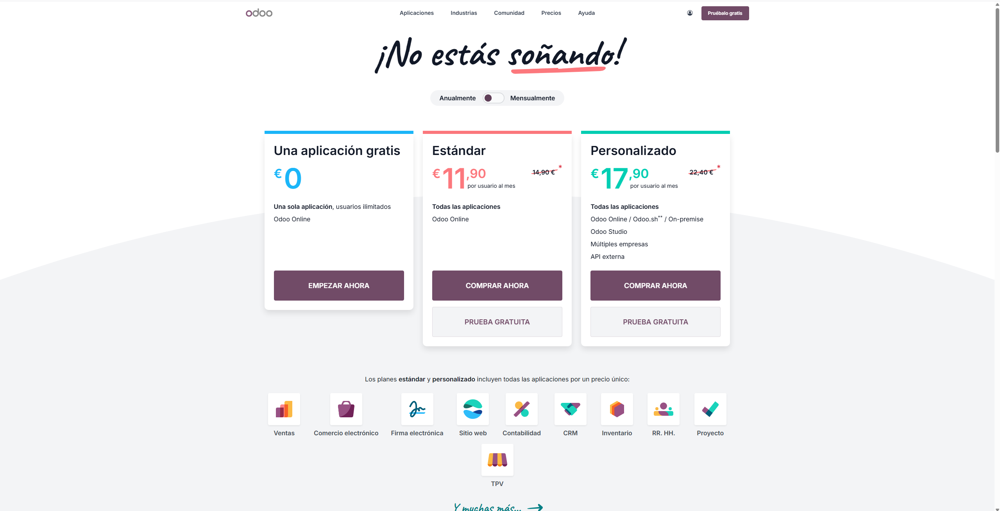

# 10 — Ediciones y costes

> Estructura orientativa

- **Community** (gratis, usuarios ilimitados, mantenimiento propio).
- **Enterprise** (SaaS, soporte, actualizaciones, app móvil, Odoo Studio).
- **Contrato anual** aunque el pago sea mensual.
- Prueba: **máx. 10 apps**.

- Community: Es la versión gratuita, con usuarios ilimitados y mantenimiento propio.

- Enterprise: Es una versión de pago que incluye soporte, actualizaciones, aplicación móvil y Odoo Studio.

