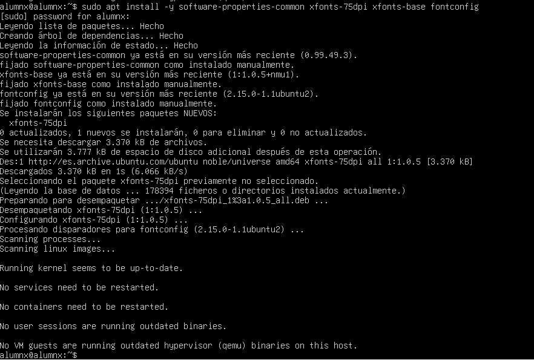
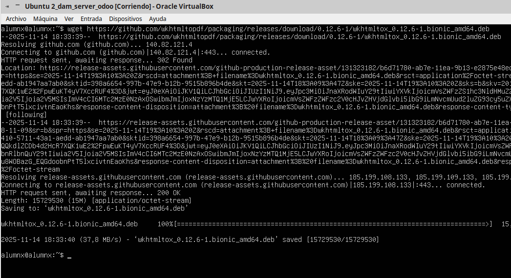

# 05 — Dependencias (Python, wkhtmltopdf, librerías)

1. Instala Python y paquetes de compilación:
   ```bash
   sudo apt -y install python3 python3-pip python3-venv build-essential libxslt1-dev      libzip-dev libldap2-dev libsasl2-dev libjpeg-dev libpq-dev
   ```
2. Instala **wkhtmltopdf** compatible (para reportes PDF).

3. Verifica versiones:
   ```bash
   python3 --version
   wkhtmltopdf --version
   ```

> Resultado esperado: dependencias instaladas y comprobadas.

- Instalo python usando el comando sudo apt install python3 python3-pip -y

- Instalo los paquetes necesarios para compilar python usando el comando sudo apt install python3 python3-pip -y

- Instalo las dependencias con el comando: sudo apt install -y software-properties-common xfonts-75dpi xfonts-base fontconfig
   

- Descarlo la version estable de wkhtmltopdf usand el comando: wget https://github.com/wkhtmltopdf/packaging/releases/download/0.12.6-1/wkhtmltox_0.12.6-1.bionic_amd64.deb

   

- 

