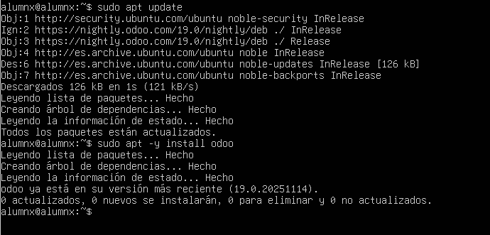
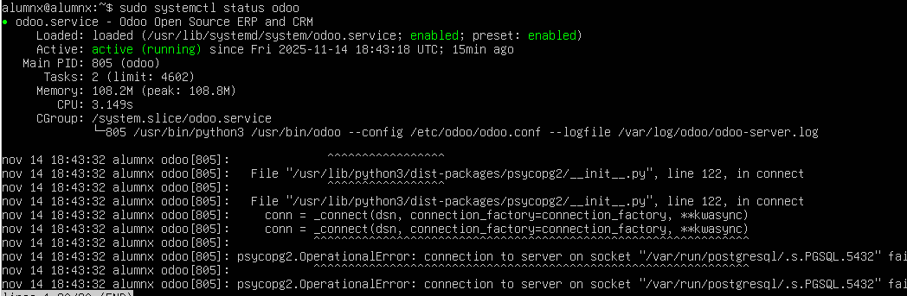

# 06 — Instalación de Odoo

> Elige uno de los métodos y documenta tu elección.

## Método A — Paquete oficial (repositorio Odoo)

- Para instalar odoo primero uso el comando: sudo apt install wget gnupg2 -y

- Luego descargo y agrego la clave GPG con el codigo: wget -O - https://nightly.odoo.com/odoo.key | sudo gpg --dearmor -o /usr/share/keyrings/odoo-archive-keyring.gpg

- Luego uso los comandos "sudo apt update" y  "sudo apt -y install odoo"
   
- Verifico si está instalado con el comando "sudo systemctl status odoo"

   
